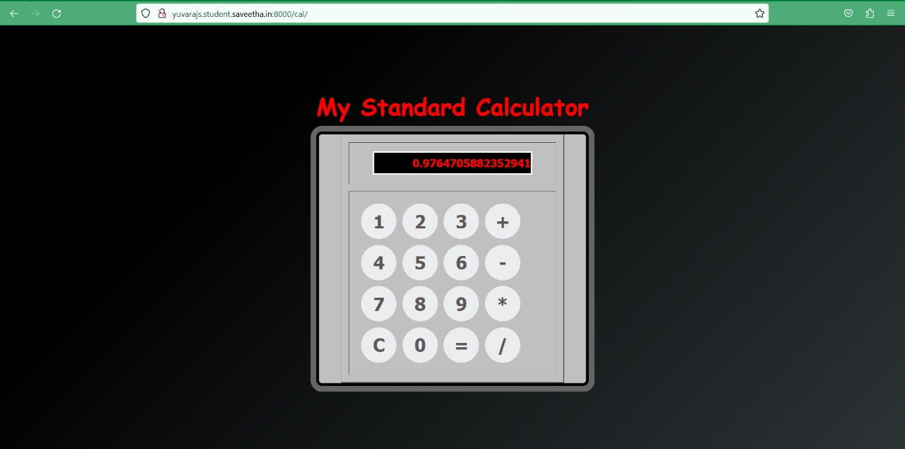

# Design of a Standard Calculator

## AIM:

To design a web application for a standard calculator.

## DESIGN STEPS:

### Step 1:
First we want fork and clone the repository,then we want to create a project and app
using django framework. 
### Step 2:
In app we want to create the templates folder follows with app folder in that app folder 
we want to create a required html files.
### Step 3:
Change the settings.py,views.py,urls.py
### Step 4:
Then we want to write a revalent code in that html file
### Step 5:
Then we want to run the server.

### Step 6:

Validate the HTML and CSS code.

### Step 6:

Publish the website in the given URL.

## PROGRAM :
```python
<! DOCTYPE html>  
<html>  
    <head>  
    <meta charset="utf-8">  
    <title>  
         My Standard Calculator
    </title>  
    <!-- CSS property to create interactive  
        calculator interface -->  
    <style>  
    html {  
  height: 100vh;  
  display: flex;  
  align-items: center;  
  justify-content: center;  
  background-color: #2d3436;  
  background-image: linear-gradient(315deg, #2d3436 0%, #000000 74%);  
  font-family: 'Cookie', cursive;  
}  
.title {  
margin-bottom: 10px;  
padding: 5px 0;  
font-size: 40px;  
font-weight: bold;  
text-align: center;  
color: red;  
font-family: 'Cookie', cursive;  
}  
input[type=button] {  
  width: 60px;  
  height: 60px;  
  float: left;  
  padding: 0;  
  margin: 5px;  
  box-sizing: border-box;  
  background: #ecedef;  
  border: none;  
  font-size: 30px;  
  line-height: 30px;  
  border-radius: 50%;  
  font-weight: 700;  
  color: #5E5858;  
  cursor: pointer;    
}  
input[type=text] {  
  width: 270px;  
  height: 60px;  
  float: left;  
  padding: 0;  
  box-sizing: border-box;  
  border: none;  
  background: none;  
  color: red;  
  text-align: right;  
  font-weight: 700;  
  font-size: 60px;  
  line-height: 60px;  
  margin: 0 25px;  
  }  
.calculator {  
  background-color: #c0c0c0;  
  box-shadow: 0px 0px 0px 10px #666;  
  border: 5px solid black;  
  border-radius: 10px;  
} 
 
#display {  
  height: 40px;  
  text-align: right;  
  background-color: black;  
  border: 3px solid white;  
  font-size: 18px;  
  left: 2px;  
  top: 2px;  
  color: red;  
}  
.btnTop {  
  color: white;  
  background-color: #6f6f6f;  
  font-size: 14px;  
  margin: auto;  
  width: 50px;  
  height: 25px;  
}     
    </style>  
        <script type="text/javascript">
        function calculate(args)
        {
            res = document.getElementById("result");
            expression = res.innerText;
            cmd = args.srcElement.innerText;
            if(cmd == "=")
            {
                expression = "" + eval(expression)
            }else if(cmd == "C")
            {
                expression = " "
            }
            else{
                expression = expression + cmd;
            }
            res.innerText = expression;
            // alert("CLICKED"+cmd)

        }
         var x,y,z;
            alert("WELCOME TO JAVASCRIPT PROGRAMMING");
            x = 200;
            y = 400;
            z=x+y;
            console.log("z="+z)
        </script>
</head>  
<body>  
    <div class = "title"  align="center">  
        My Standard Calculator 
    </div>  
    <form name="Calculator" class = "calculator" >  
<table border="2" align="center" cellpadding="15" cellspacing="12" bgcolor="#c0c0c0">  
<tr>  
<td>  
<input type="text" name="Input" Size="35" id="display">  
<br>  
</td>  
</tr>  
<tr>  
<td>  
<input type="button" name = "one" style="font-size:30px" value=" 1 " OnClick="Calculator.Input.value += '1'">  
<input type="button" name = "two" style = "font-size:30px" value=" 2 " OnCLick="Calculator.Input.value += '2'">  
<input type="button" name = "three" style="font-size:30px" value=" 3 " OnClick="Calculator.Input.value += '3'">  
<input type="button" name="add" class ="btnTop" style="font-size:30px" value=" + " OnClick="Calculator.Input.value += ' + '">  
<br>  
<input type="button" name = "four" style="font-size:30px" value=" 4 " OnClick="Calculator.Input.value += '4'">  
<input type="button" name = "five" style="font-size:30px" value=" 5 " OnCLick="Calculator.Input.value += '5'">  
<input type="button" name = "six" style="font-size:30px" value=" 6 " OnClick="Calculator.Input.value += '6'">  
<input type="button" name = "minus" style="font-size:30px" value=" - " OnClick="Calculator.Input.value += ' - '">  
<br>  
<input type="button" name = "seven" style="font-size:30px" value=" 7 " OnClick="Calculator.Input.value += '7'">  
<input type="button" name = "eight" style="font-size:30px" value=" 8 " OnCLick="Calculator.Input.value += '8'">  
<input type="button" name = "nine" style="font-size:30px" value=" 9 " OnClick="Calculator.Input.value += '9'">  
<input type="button" name = "mul" style="font-size:30px" value=" * "   
OnClick="Calculator.Input.value += ' * '">  
<br>  
<input type="button" name = "clear" style="font-size:30px" value=" C " OnClick="Calculator.Input.value = ''">  
<input type="button" name="zero" style="font-size:30px" value=" 0 " OnClick="Calculator.Input.value += '0'">  
<input type="button" name="DoIt" style="font-size:30px" value=" = " OnClick="Calculator.Input.value = eval(Calculator.Input.value)">  
<input type="button" name="div" style="font-size:30px" value=" / " OnClick="Calculator.Input.value += ' / '">  
<br>  
</td>  
  
</tr>  
</table>  
</form>  
</body>  
</html>

```

## OUTPUT:
### Calculator output

### Validator


## Result:
The output for calculator is displayed successfully.
